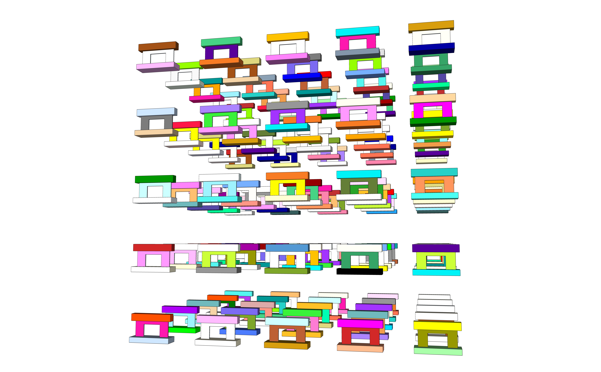

# Design Structures by Ruby in Sketchup

Automatic SketchUp Creating 3-D Models in Ruby by Matthew Scarpino


[TOC]


## 01 Install Sketchup

Now, It has turned "Online based app". So, "Subscription" is required.


## 02 First example

### Draw a line

Go to the Ruby console

- Menu > Window > Ruby console

And execute the follows

```ruby
Sketchup.active_model.entities.add_line [0,0,0], [5,5,5]
```


### 단위변환

숫자.변경하기를 원하는 단위이름

examples

```ruby
3.14159265358979.radians = 180
180.degrees = 3.14159265358979
2.54.cm = 1 (centimeter ➔ Inch)
72.to_m (72 inches to meters)
```


### 범위설정 (Interval)

```ruby
0...4  ➔ [0, 1, 2, 3]
0..4   ➔ [0, 1, 2, 3, 4]
-5..-3 ➔ [-5, -4, -3]

"HelloWorld"[0..2]  ➔ Hel
"HelloWorld"[0...2] ➔ He
"HelloWorld"[3, 4]  ➔ loWo 인덱스, 길이
```


### Array operation

|   공통되는 내용은 1번만 나오게 해서 합친다

& 공통되는 부분만 저장한다


## 03 Sketchup scripting

star

```ruby
# Access the current Entities object 
ents = Sketchup.active_model.entities

=begin
Create five points in three dimensions Each point is the vertex of a star shape 
=end

# Draw five lines in a star pattern
pt1 = [0, 100, 0]
pt2 = [58.8, -80.9, 0]
pt3 = [-95.1, 30.9, 0] 
pt4 = [95.1, 30.9, 0] 
pt5 = [-58.8, -80.9, 0]

ents.add_line pt1, pt2 
ents.add_line pt2, pt3 
ents.add_line pt3, pt4 
ents.add_line pt4, pt5 
ents.add_line pt5, pt1
```


Curve

```ruby
pt1 = [0, 1000, 0]
pt2 = [588, -809, 0]
pt3 = [-951, 309, 0] 
pt4 = [951, 309, 0] 
pt5 = [-588, -809, 0]

curve = Sketchup.active_model.entities.add_curve pt1, pt2, pt3, pt4, pt5, pt1
```


Circle

```ruby
circle = Sketchup.active_model.entities.add_circle [1, 2, 3], [4, 5, 6], 7

circle = Sketchup.active_model.entities.add_circle [10, 20, 30], [40, 50, 60], 70, 12
# 마지막 12는 세그먼트를 의미: 12 or 24 or 72
```


Polygon

```ruby
ents = Sketchup.active_model.entities 
normal = [0, 50, 0] 
radius = 50

# 여기서부터 그림이 나온다
# Polygon with 8 sides
ents.add_ngon [0, 0, 0], normal, radius, 8 

# Circle with 8 sides
ents.add_circle [3, 0, 0], normal, radius, 8 

# Polygon with 24 sides
ents.add_ngon [6, 0, 0], normal, radius, 24 

# Circle with 24 sides
ents.add_circle [9, 0, 0], normal, radius
```


Arcs

```ruby
arc = Sketchup.active_model.entities.add_arc [0,0,0], [0,1,0], [0,0,1], 5, 0, 90.degrees

arc = Sketchup.active_model.entities.add_arc [0,0,0], [0,100,0], [0,0,100], 50, 0, 90.degrees
```


Pentagon

```ruby
# Create the five points of the pentagon 
pt1 = [0, 10, 0] 
pt2 = [-9.51, 3.09, 0] 
pt3 = [-5.88, -8.09, 0] 
pt4 = [ 5.88, -8.09, 0] 
pt5 = [ 9.51, 3.09, 0]

# Draw the face
pent = Sketchup.active_model.entities.add_face pt1, pt2, pt3, pt4, pt5

# Display the locations of the stored vertices 
puts "Point 0: " + pent.vertices[0].position.to_s 
puts "Point 1: " + pent.vertices[1].position.to_s 
puts "Point 2: " + pent.vertices[2].position.to_s 
puts "Point 3: " + pent.vertices[3].position.to_s
puts "Point 4: " + pent.vertices[4].position.to_s
```


cutbox

```ruby
# Create the box
ent = Sketchup.active_model.entities
main_face = ent.add_face [0,0,0], [6,0,0], [6,8,0], [0,8,0] 
main_face.reverse! 
main_face.pushpull 5

# Draw a line across the upper-right corner 
cut = ent.add_line [6,6,5], [4,8,5]

# Remove the new face 
cut.faces[1].pushpull -5
```


followme

```ruby
# Access the Entities container 
model = Sketchup.active_model 
ent = model.entities

# Create the primary face
circle = ent.add_circle [0,0,0], [0,0,1], 2 
circle_face = ent.add_face circle

# Create the path
path = ent.add_curve [10,0,0], [10,0,5], [10,5,5], [10,5,0], [10,0,0]

# Extrude the circle along the path
circle_face.followme path
```


lathe

```ruby
# Access the Entities object 
model = Sketchup.active_model 
ents = model.entities

# Create the 2-D shape
curve = ents.add_curve [0, 0, 1.244209], [0.116554, 0, 1.238382], [0.160261, 0, 1.217985], [0.186486, 0, 1.188846], [0.1894, 0, 1.165536], [0.17483, 0, 1.145139],[0.142778, 0, 1.127656], [0.096157, 0, 1.118914], [0.093243, 0, 1.063551], [0.175152, 0, 0.996269], [0.175152, 0, 0.915269], [0.28237, 0, 0.871026], [0.375392, 0, 0.801741], [0.448486, 0, 0.711683], [0.497151, 0, 0.606398], [0.51839, 0, 0.492371], [0.510894, 0, 0.376625], [0.475126, 0, 0.26629], [0.413287, 0, 0.168161], [0.329188, 0, 0.088283], [0.228007, 0, 0.031575], [0.115978, 0, 0.001531], [0, 0, 0], [0, 0, 1.244209] 

curve_face = ents.add_face curve

# Create the circular path 
path = ents.add_circle [0, 0, 0], [0, 0, 1], 2

# Create the figure 
curve_face.followme path
```


chamfer

```ruby
# Create the box
ents = Sketchup.active_model.entities
main_face = ents.add_face [0,0,0], [5,0,0], [5,8,0], [0,8,0] 
main_face.reverse!
main_face.pushpull 6, true

# Draw a line across a corner 
cut = ents.add_line [5, 7, 6], [5, 8, 5] 

# Create the chamfer
cut.faces[0].followme main_face.edges
```


Sphere

```ruby
# Access the Entities object 
ents = Sketchup.active_model.entities

# Create the initial circle 
center = [0, 0, 0] 
radius = 150
circle = ents.add_circle center, [0, 0, 1], radius 
circle_face = ents.add_face circle

# Create the circular path 
path = ents.add_circle center, [0, 1, 0], radius + 1

# Create the sphere 
circle_face.followme path

# Remove the path 
ents.erase_entities path
```


Thesis structures

- Prototype wall

```ruby
ent = Sketchup.active_model.entities

base = ent.add_face [0,0,0], [2400,0,0], [2400,0,300], [0,0,300]
base.reverse!
base.pushpull 800 

wall = ent.add_face [200,365,300], [2200,365,300], [2200,365,1200], [200,365,1200]
wall.reverse!
wall.pushpull 70

top = ent.add_face [0,200,1200], [2400,200,1200], [2400,200,1600], [0,200,1600]
top.reverse!
top.pushpull 400
```

```ruby
ent = Sketchup.active_model.entities

x = 100
y = 100
z = 100

base = ent.add_face [x+0,y+0,z+0], [x+2400,y+0,z+0], [x+2400,y+0,z+300], [x+0,y+0,z+300]
base.reverse!
base.pushpull 800 

wall = ent.add_face [x+200,y+365,z+300], [x+2200,y+365,z+300], [x+2200,y+365,z+1200], [x+200,y+365,z+1200]
wall.reverse!
wall.pushpull 70

top = ent.add_face [x+0,y+200,z+1200], [x+2400,y+200,z+1200], [x+2400,y+200,z+1600], [x+0,y+200,z+1600]
top.reverse!
top.pushpull 400
```


- Wall I 0.30

```ruby
# Absolute coord

ent = Sketchup.active_model.entities

base = ent.add_face [0,0,0], [2400,0,0], [2400,0,300], [0,0,300]
base.reverse!
base.pushpull 800 

top = ent.add_face [0,200,1200], [2400,200,1200], [2400,200,1600], [0,200,1600]
top.reverse!
top.pushpull 400

opening030_right = ent.add_face [200,365,300], [700,365,300], [700,365,1200], [200,365,1200]
opening030_right.reverse!
opening030_right.pushpull 70

opening030_left = ent.add_face [1540,365,300], [2200,365,300], [2200,365,1200], [1540,365,1200]
opening030_left.reverse!
opening030_left.pushpull 70
```

```ruby
# Modify coord with Loop

ent = Sketchup.active_model.entities

for a in 1..5
    
    b = 4000 * a

    x = 100 + b
	y = 100 
    z = 1000

    base = ent.add_face [x+0,y+0,z+0], [x+2400,y+0,z+0], [x+2400,y+0,z+300], [x+0,y+0,z+300]
    base.reverse!
    base.pushpull 800 

    top = ent.add_face [x+0,y+200,z+1200], [x+2400,y+200,z+1200], [x+2400,y+200,z+1600], [x+0,y+200,z+1600]
    top.reverse!
    top.pushpull 400

    opening030_right = ent.add_face [x+200,y+365,z+300], [x+900,y+365,z+300], [x+900,y+365,z+1200], [x+200,y+365,z+1200]
    opening030_right.reverse!
    opening030_right.pushpull 70

    opening030_left = ent.add_face [x+1500,y+365,z+300], [x+2200,y+365,z+300], [x+2200,y+365,z+1200], [x+1500,y+365,z+1200]
    opening030_left.reverse!
    opening030_left.pushpull 70
    
end
```


- Wall II 0.39

```ruby
#Absolute coord

ent = Sketchup.active_model.entities

base = ent.add_face [0,0,0], [2400,0,0], [2400,0,300], [0,0,300]
base.reverse!
base.pushpull 800 

wall = ent.add_face [200,365,300], [2200,365,300], [2200,365,1200], [200,365,1200]
wall.reverse!
wall.pushpull 70

top = ent.add_face [0,200,1200], [2400,200,1200], [2400,200,1600], [0,200,1600]
top.reverse!
top.pushpull 400

opening039 = ent.add_face [700,365,300], [1700,365,300], [1700,365,1000], [700,365,1000]
opening039.reverse!
opening039.pushpull 70
```

```ruby
# Modify coord with Loop

ent = Sketchup.active_model.entities

for a in 1..5
    
    b = 4000 * a

    x = 100 + b
	y = 100 
    z = 5000 

    base = ent.add_face [x+0,y+0,z+0], [x+2400,y+0,z+0], [x+2400,y+0,z+300], [x+0,y+0,z+300]
    base.reverse!
    base.pushpull 800 

    wall = ent.add_face [x+200,y+365,z+300], [x+2200,y+365,z+300], [x+2200,y+365,z+1200], [x+200,y+365,z+1200]
    wall.reverse!
    wall.pushpull 70

    top = ent.add_face [x+0,y+200,z+1200], [x+2400,y+200,z+1200], [x+2400,y+200,z+1600], [x+0,y+200,z+1600]
    top.reverse!
    top.pushpull 400

    opening039 = ent.add_face [x+700,y+365,z+300], [x+1700,y+365,z+300], [x+1700,y+365,z+1000], [x+700,y+365,z+1000]
    opening039.reverse!
    opening039.pushpull 70
    
end
```


### Color & Texture

```ruby
# Create the new material
mats = Sketchup.active_model.materials 
ct_mat = mats.add "Color_Texture"

# Assign the texture and color 
# ct_mat.texture = Sketchup.find_support_file "Ch6/checker.jpg", "Plugins" 

ct_mat.color = "DodgerBlue"

# Draw a Face and set its material 
ents = Sketchup.active_model.entities
face = ents.add_face [1, -1, 1], [1, 1, 1], [-1, 1, 1], [-1, -1, 1] 
face.material = ct_mat
```


## 04 Structures for thesis

### One structure

http://ruby.sketchup.com/Sketchup/Color.html

```ruby
# 01 Entities
ent = Sketchup.active_model.entities

# 02 Starting position & set the colors
x = 100
y = 100 
z = 100 

base_color = "LightSlateGray"
wall_color = "DarkGray"
top_color = "LightSlateGray"

# 03 Materials to Create the new material
mats = Sketchup.active_model.materials 

# 04 Materials for base, wall, top members
base_mat = mats.add "Color_Texture"
wall_mat = mats.add "Color_Texture"
top_mat = mats.add "Color_Texture"

# 05 Coord for the base member
base = ent.add_face [x+0,y+0,z+0], [x+2400,y+0,z+0], [x+2400,y+0,z+300], [x+0,y+0,z+300]

# 06 Assign the color for the base member
base_mat.color = base_color
base.material = base_mat

# 07 Reverse the face and Pushpull
base.reverse!
base.pushpull 800 

# 08 Coord for the wall member
wall = ent.add_face [x+200,y+365,z+300], [x+2200,y+365,z+300], [x+2200,y+365,z+1200], [x+200,y+365,z+1200]

# 09 Assign the color for the wall member
wall_mat.color = wall_color
wall.material = wall_mat

# 10 Reverse the face and Pushpull
wall.reverse!
wall.pushpull 70

# 11 Coord for the top member
top = ent.add_face [x+0,y+200,z+1200], [x+2400,y+200,z+1200], [x+2400,y+200,z+1600], [x+0,y+200,z+1600]

# 12 Assign the color for the top member
top_mat.color = top_color
top.material = top_mat

# 13 Reverse the face and Pushpull
top.reverse!
top.pushpull 400

# 14 Design the opening
opening039 = ent.add_face [x+700,y+365,z+300], [x+1700,y+365,z+300], [x+1700,y+365,z+1000], [x+700,y+365,z+1000]
opening039.reverse!
opening039.pushpull 70
```


### Five structures in a row

```ruby
# 01 Entities
ent = Sketchup.active_model.entities

# 02 Start the loop: Make 5 structures in a row
for a in 1..5

# 03 Starting position & set the colors
    b = 4000 * a
    
    x = 100 + b
	y = 100 
	z = 100 

    base_color = "LightSlateGray"
    wall_color = "DarkGray"
    top_color = "LightSlateGray"

# 04 Materials to Create the new material
	mats = Sketchup.active_model.materials 

# 05 Materials for base, wall, top members
    base_mat = mats.add "Color_Texture"
    wall_mat = mats.add "Color_Texture"
    top_mat = mats.add "Color_Texture"

# 06 Coord for the base member
	base = ent.add_face [x+0,y+0,z+0], [x+2400,y+0,z+0], [x+2400,y+0,z+300], [x+0,y+0,z+300]

# 07 Assign the color for the base member
    base_mat.color = base_color
    base.material = base_mat

# 08 Reverse the face and Pushpull
    base.reverse!
    base.pushpull 800 

# 09 Coord for the wall member
	wall = ent.add_face [x+200,y+365,z+300], [x+2200,y+365,z+300], [x+2200,y+365,z+1200], [x+200,y+365,z+1200]

# 10 Assign the color for the wall member
    wall_mat.color = wall_color
    wall.material = wall_mat

# 11 Reverse the face and Pushpull
    wall.reverse!
    wall.pushpull 70

# 12 Coord for the top member
	top = ent.add_face [x+0,y+200,z+1200], [x+2400,y+200,z+1200], [x+2400,y+200,z+1600], [x+0,y+200,z+1600]

# 13 Assign the color for the top member
    top_mat.color = top_color
    top.material = top_mat

# 14 Reverse the face and Pushpull
    top.reverse!
    top.pushpull 400

# 15 Design the opening
	opening039 = ent.add_face [x+700,y+365,z+300], [x+1700,y+365,z+300], [x+1700,y+365,z+1000], [x+700,y+365,z+1000]
	opening039.reverse!
	opening039.pushpull 70
    
# 16 End the loop    
end
```


### Development Length

```ruby
# 01 Entities
ent = Sketchup.active_model.entities

# 02 Set starting position
x = 100
y = 100 
z = 100 

# 03 Set Development lengh
# 정착길이는 벽체의 두께에 포함
a = 40 # Left& Right
b = 20 # Top
c = 10 # Bottom
d = 100 # Between "base" and "bottom development length"

## 중간에 위치하는 개구부를 만들려면 아래를 사용
##b = c
##e = d

# 04 Size of Opening
# Size of wall: 2000 * 900
o_w = 1600
o_h = 300

## 중간에 위치하는 개구부를 만들려면 아래를 사용
##o_h = 900 - b - c - d - e

# 05 Coordinates
x_1 = x + 200
x_2 = x + 2200
x_3 = x_1 + (2000 - ( a + o_w + a ))/2
x_4 = x_3 + a + o_w + a
x_5 = x_3 + a
x_6 = x_3 + a + o_w
y_1 = y + 365
z_1 = z + 300
z_2 = z + 1200
z_3 = z_1 + d
z_4 = z_1 + d + c + o_h + b
z_5 = z_1 + d + c + o_h
z_6 = z_1 + d + c

# 06 Set colors
## Randome color step 01
##array = Sketchup::Color.names

base_color = "LightSlateGray"
wall_color = "DarkGray"
top_color = "LightSlateGray"
development_length_color = "Red"

# 07 Materials to Create the new material
mats = Sketchup.active_model.materials 

# 08 Materials for base, wall, top members
base_mat = mats.add "Color_Texture"
top_mat = mats.add "Color_Texture"
wall_01_mat = mats.add "Color_Texture"
wall_02_mat = mats.add "Color_Texture"
wall_03_mat = mats.add "Color_Texture"
wall_04_mat = mats.add "Color_Texture"
wall_05_mat = mats.add "Color_Texture"
development_length_01_mat = mats.add "Color_Texture"
development_length_02_mat = mats.add "Color_Texture"
development_length_03_mat = mats.add "Color_Texture"
development_length_04_mat = mats.add "Color_Texture"

# 09 Coord for the base member
base = ent.add_face [x+0,y+0,z+0], [x+2400,y+0,z+0], [x+2400,y+0,z+300], [x+0,y+0,z+300]

# 10 Assign the color for the base member
base_mat.color = base_color
## Randome color step 02
##base_mat.color = array[rand(140)]
base.material = base_mat

# 11 Reverse the face and Pushpull
base.reverse!
base.pushpull 800 

# 12 Coord for the top member
top = ent.add_face [x+0,y+200,z+1200], [x+2400,y+200,z+1200], [x+2400,y+200,z+1600], [x+0,y+200,z+1600]

# 13 Assign the color for the top member
top_mat.color = top_color
top.material = top_mat

# 14 Reverse the face and Pushpull
top.reverse!
top.pushpull 400

# 15 Coord for the wall(left) member
wall_01 = ent.add_face [x_1, y_1, z_1], [x_3, y_1, z_1], [x_3, y_1, z_2], [x_1, y_1, z_2]

# 16 Assign the color for the wall(left) member
wall_01_mat.color = wall_color
wall_01.material = wall_01_mat

# 17 Reverse the face and Pushpull
wall_01.reverse!
wall_01.pushpull 70

# 18 Coord for the development length(left)
development_length_01 = ent.add_face [x_3, y_1, z_3], [x_5, y_1, z_3], [x_5, y_1, z_4], [x_3, y_1, z_4]

# 19 Assign the color for the development length(left)
development_length_01_mat.color = development_length_color
development_length_01.material = development_length_01_mat

# 20 Reverse the face and Pushpull
development_length_01.reverse!
development_length_01.pushpull 70

# 21 Coord for the wall(right) member
wall_02 = ent.add_face [x_4, y_1, z_1], [x_2, y_1, z_1], [x_2, y_1, z_2], [x_4, y_1, z_2]

# 22 Assign the color for the wall(right) member
wall_02_mat.color = wall_color
wall_02.material = wall_02_mat

# 23 Reverse the face and Pushpull
wall_02.reverse!
wall_02.pushpull 70

# 24 Coord for the development length(right)
development_length_02 = ent.add_face [x_6, y_1, z_3], [x_4, y_1, z_3], [x_4, y_1, z_4], [x_6, y_1, z_4]

# 25 Assign the color for the development length(right)
development_length_02_mat.color = development_length_color
development_length_02.material = development_length_02_mat

# 26 Reverse the face and Pushpull
development_length_02.reverse!
development_length_02.pushpull 70

# 27 Coord for the wall member(top)
wall_03 = ent.add_face [x_3, y_1, z_4], [x_4, y_1, z_4], [x_4, y_1, z_2], [x_3, y_1, z_2]

# 28 Assign the color for the wall member(top)
wall_03_mat.color = wall_color
wall_03.material = wall_03_mat

# 29 Reverse the face and Pushpull
wall_03.reverse!
wall_03.pushpull 70

# 30 Coord for the development length(top)
development_length_03 = ent.add_face [x_5, y_1, z_5], [x_6, y_1, z_5], [x_6, y_1, z_4], [x_5, y_1, z_4]

# 31 Assign the color for the development length(top)
development_length_03_mat.color = development_length_color
development_length_03.material = development_length_03_mat

# 32 Reverse the face and Pushpull
development_length_03.reverse!
development_length_03.pushpull 70

# 33 Coord for the development length(bottom)
development_length_04 = ent.add_face [x_5, y_1, z_3], [x_6, y_1, z_3], [x_6, y_1, z_6], [x_5, y_1, z_6]

# 34 Assign the color for the development length(bottom)
development_length_04_mat.color = development_length_color
development_length_04.material = development_length_04_mat

# 35 Reverse the face and Pushpull
development_length_04.reverse!
development_length_04.pushpull 70

# 36 Coord for the wall member(bottom)
wall_04 = ent.add_face [x_3, y_1, z_1], [x_4, y_1, z_1], [x_4, y_1, z_3], [x_3, y_1, z_3]

# 37 Assign the color for the wall member(bottom)
wall_04_mat.color = wall_color
wall_04.material = wall_04_mat

# 38 Reverse the face and Pushpull
wall_04.reverse!
wall_04.pushpull 70
```


### Random color & Make an array of structures (5x5x5)

```ruby
# 01 Entities
ent = Sketchup.active_model.entities

# 02 Start the loop: Make 5 structures in a row
for a in 1..5
for b in 1..5
for c in 1..5
    
# 03 Starting position & Loop variables
    n = 4000 * a
    m = 4000 * b
    o = 4000 * c
    
    x = 100 + n
	y = 100 + m
	z = 100 + o
    
# 04 Materials to Create the new material
	mats = Sketchup.active_model.materials 

# 05 Materials for base, wall, top members
    base_mat = mats.add "Color_Texture"
    wall_mat = mats.add "Color_Texture"
    top_mat = mats.add "Color_Texture"

# 06 Coord for the base member
	base = ent.add_face [x+0,y+0,z+0], [x+2400,y+0,z+0], [x+2400,y+0,z+300], [x+0,y+0,z+300]

# 07 Assign the color for the base member
    array = Sketchup::Color.names
    base_mat.color = array[rand(140)]
    base.material = base_mat

# 08 Reverse the face and Pushpull
    base.reverse!
    base.pushpull 800 

# 09 Coord for the wall member
	wall = ent.add_face [x+200,y+365,z+300], [x+2200,y+365,z+300], [x+2200,y+365,z+1200], [x+200,y+365,z+1200]

# 10 Assign the color for the wall member
    wall_mat.color = array[rand(140)]
    wall.material = wall_mat

# 11 Reverse the face and Pushpull
    wall.reverse!
    wall.pushpull 70

# 12 Coord for the top member
	top = ent.add_face [x+0,y+200,z+1200], [x+2400,y+200,z+1200], [x+2400,y+200,z+1600], [x+0,y+200,z+1600]

# 13 Assign the color for the top member
    top_mat.color = array[rand(140)]
    top.material = top_mat

# 14 Reverse the face and Pushpull
    top.reverse!
    top.pushpull 400

# 15 Design the opening
	opening039 = ent.add_face [x+700,y+365,z+300], [x+1700,y+365,z+300], [x+1700,y+365,z+1000], [x+700,y+365,z+1000]
	opening039.reverse!
	opening039.pushpull 70
    
# 16 End the loop    
end
end
end
```





## Resources

How to random color a Component?: <https://forums.sketchup.com/t/how-to-random-color-a-component/38881>


If you have a file with the .rb extension, you can install the plugin by placing the Ruby script file into the appropriate folder, and then restarting SketchUp. Windows - the default location is: SketchUp 2018: C:\Users\YOUR USERNAME\AppData\Roaming\SketchUp\SketchUp 2018\SketchUp\Plugins.

