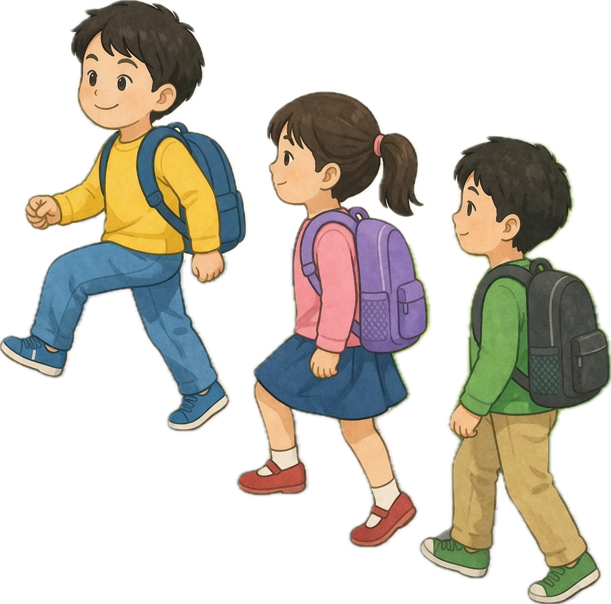
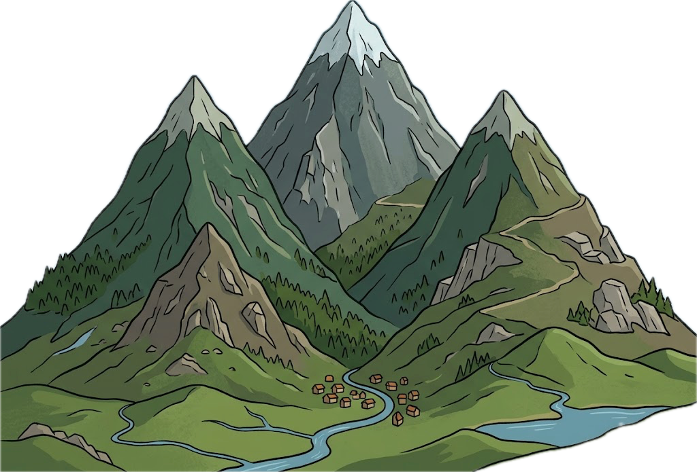
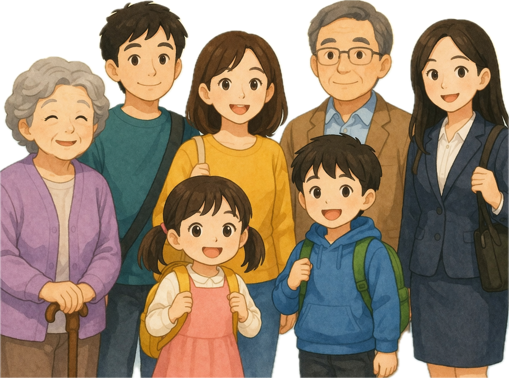
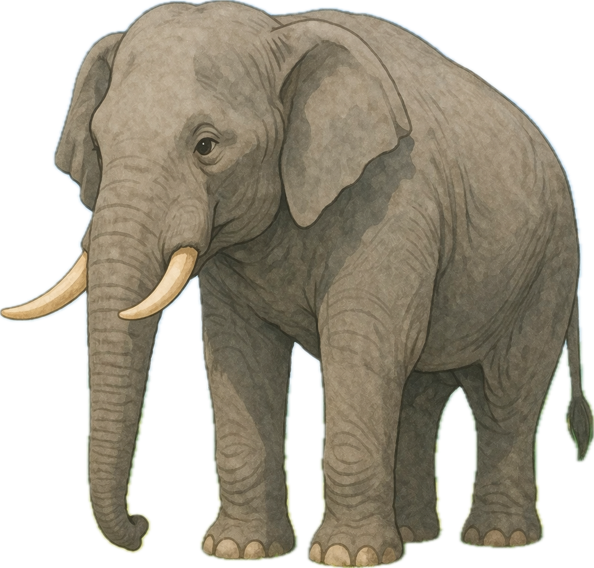
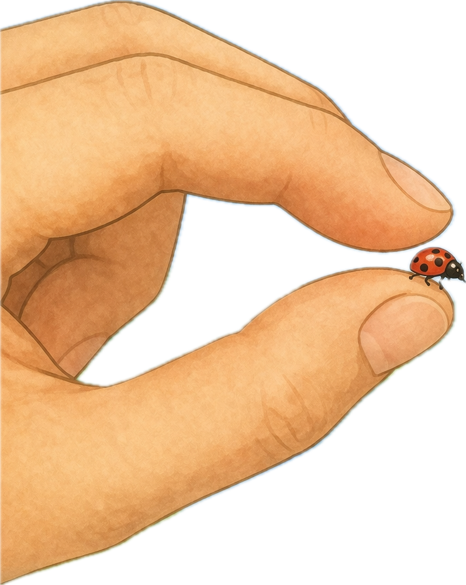

# memory deck
@title: 한문 기초 어휘
@subject: 한문
@category: language
@tags: 한문,한자,국어,기초
@priority: 6
@interval: 3

| 단어 | 의미 | 프롬프트 | 도해 |
| --- | --- | --- | --- |
| 學 | 배우다 | 학습용 메모리카드에 들어갈 개념 그림 한 장을 만들어줘. 단어: 學 의미: 배우다 조건: - 비율 4:3 - 텍스트, 글자, 단어, 자막, 라벨 넣지 말 것 - 영어/한글 삽입 금지 - 노트북 화면, 포스터, 인포그래픽 프레임, 말풍선 금지 - 핵심 장면만 크게 - 흰 여백 최소화 - 단순한 교과서형 도해 스타일 |  |
| 校 | 학교 | 학습용 메모리카드에 들어갈 개념 그림 한 장을 만들어줘. 단어: 校 의미: 학교 조건: - 비율 4:3 - 텍스트, 글자, 단어, 자막, 라벨 넣지 말 것 - 영어/한글 삽입 금지 - 노트북 화면, 포스터, 인포그래픽 프레임, 말풍선 금지 - 핵심 장면만 크게 - 흰 여백 최소화 - 단순한 교과서형 도해 스타일 |  |
| 先 | 먼저 | 학습용 메모리카드에 들어갈 개념 그림 한 장을 만들어줘. 단어: 先 의미: 먼저 조건: - 비율 4:3 - 텍스트, 글자, 단어, 자막, 라벨 넣지 말 것 - 영어/한글 삽입 금지 - 노트북 화면, 포스터, 인포그래픽 프레임, 말풍선 금지 - 핵심 장면만 크게 - 흰 여백 최소화 - 단순한 교과서형 도해 스타일 |  |
| 生 | 삶 또는 생기다 | 학습용 메모리카드에 들어갈 개념 그림 한 장을 만들어줘. 단어: 生 의미: 삶 또는 생기다 조건: - 비율 4:3 - 텍스트, 글자, 단어, 자막, 라벨 넣지 말 것 - 영어/한글 삽입 금지 - 노트북 화면, 포스터, 인포그래픽 프레임, 말풍선 금지 - 핵심 장면만 크게 - 흰 여백 최소화 - 단순한 교과서형 도해 스타일 |  |
| 山 | 산 | 학습용 메모리카드에 들어갈 개념 그림 한 장을 만들어줘. 단어: 山 의미: 산 조건: - 비율 4:3 - 텍스트, 글자, 단어, 자막, 라벨 넣지 말 것 - 영어/한글 삽입 금지 - 노트북 화면, 포스터, 인포그래픽 프레임, 말풍선 금지 - 핵심 장면만 크게 - 흰 여백 최소화 - 단순한 교과서형 도해 스타일 |  |
| 水 | 물 | 학습용 메모리카드에 들어갈 개념 그림 한 장을 만들어줘. 단어: 水 의미: 물 조건: - 비율 4:3 - 텍스트, 글자, 단어, 자막, 라벨 넣지 말 것 - 영어/한글 삽입 금지 - 노트북 화면, 포스터, 인포그래픽 프레임, 말풍선 금지 - 핵심 장면만 크게 - 흰 여백 최소화 - 단순한 교과서형 도해 스타일 |  |
| 心 | 마음 | 학습용 메모리카드에 들어갈 개념 그림 한 장을 만들어줘. 단어: 心 의미: 마음 조건: - 비율 4:3 - 텍스트, 글자, 단어, 자막, 라벨 넣지 말 것 - 영어/한글 삽입 금지 - 노트북 화면, 포스터, 인포그래픽 프레임, 말풍선 금지 - 핵심 장면만 크게 - 흰 여백 최소화 - 단순한 교과서형 도해 스타일 |  |
| 人 | 사람 | 학습용 메모리카드에 들어갈 개념 그림 한 장을 만들어줘. 단어: 人 의미: 사람 조건: - 비율 4:3 - 텍스트, 글자, 단어, 자막, 라벨 넣지 말 것 - 영어/한글 삽입 금지 - 노트북 화면, 포스터, 인포그래픽 프레임, 말풍선 금지 - 핵심 장면만 크게 - 흰 여백 최소화 - 단순한 교과서형 도해 스타일 |  |
| 大 | 크다 | 학습용 메모리카드에 들어갈 개념 그림 한 장을 만들어줘. 단어: 大 의미: 크다 조건: - 비율 4:3 - 텍스트, 글자, 단어, 자막, 라벨 넣지 말 것 - 영어/한글 삽입 금지 - 노트북 화면, 포스터, 인포그래픽 프레임, 말풍선 금지 - 핵심 장면만 크게 - 흰 여백 최소화 - 단순한 교과서형 도해 스타일 |  |
| 小 | 작다 | 학습용 메모리카드에 들어갈 개념 그림 한 장을 만들어줘. 단어: 小 의미: 작다 조건: - 비율 4:3 - 텍스트, 글자, 단어, 자막, 라벨 넣지 말 것 - 영어/한글 삽입 금지 - 노트북 화면, 포스터, 인포그래픽 프레임, 말풍선 금지 - 핵심 장면만 크게 - 흰 여백 최소화 - 단순한 교과서형 도해 스타일 |  |
