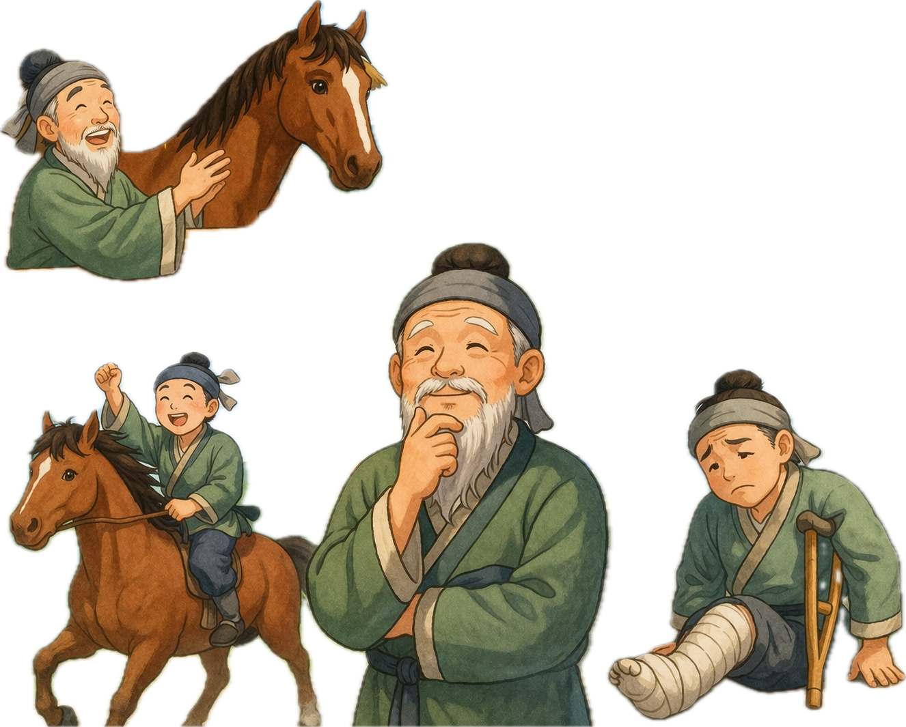
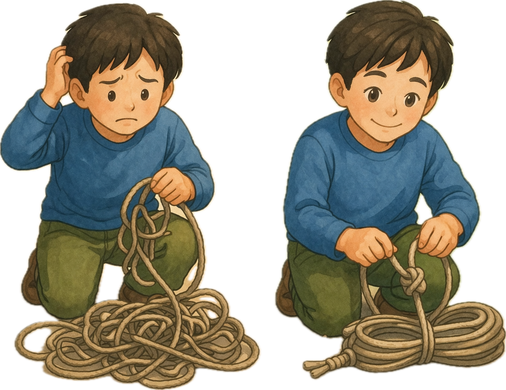
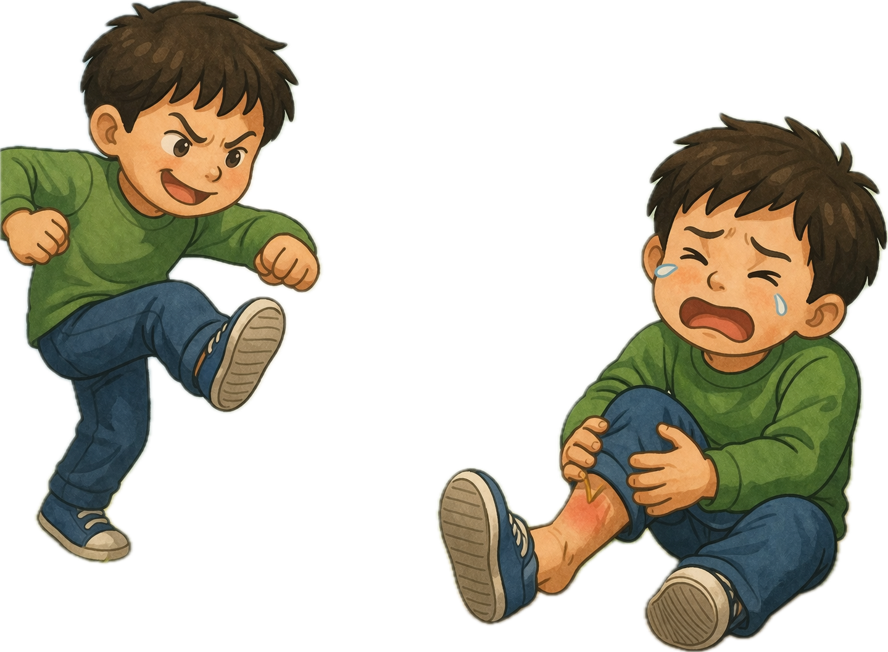
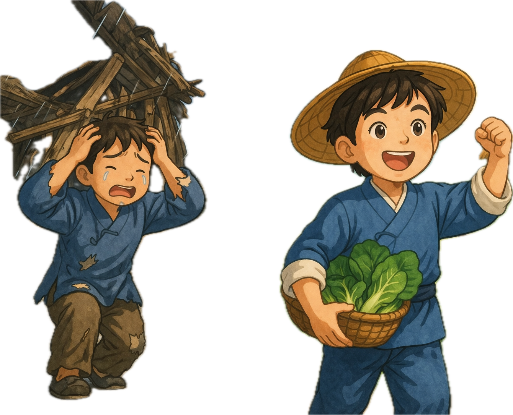
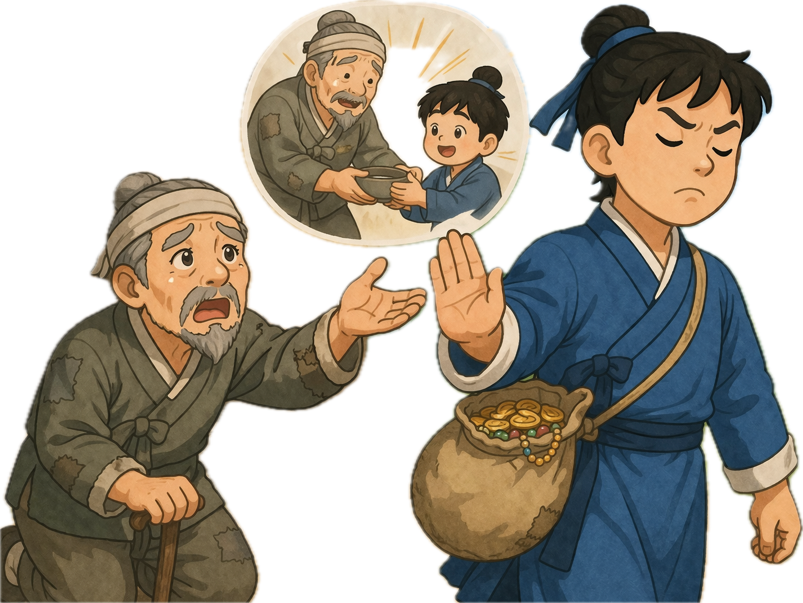
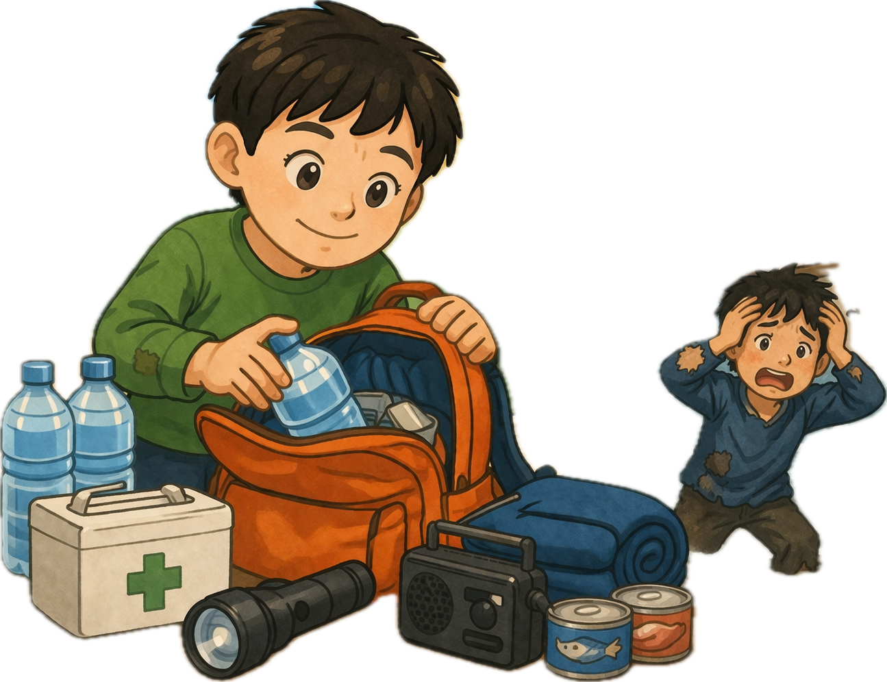
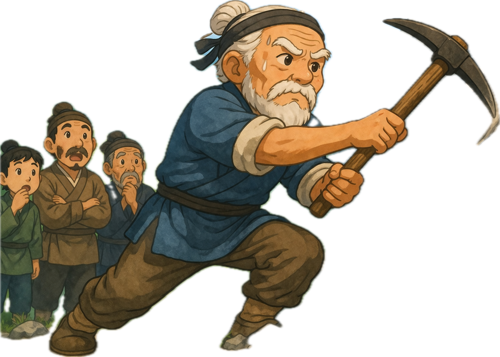

# memory deck
@title: 고사성어 기본
@subject: 고사성어
@category: idiom
@tags: 국어,고사성어,한자,시험
@priority: 6
@interval: 3

| 단어 | 의미 | 프롬프트 | 도해 |
| --- | --- | --- | --- |
| 새옹지마 | 인생의 길흉화복은 예측하기 어렵다는 뜻 | 학습용 메모리카드에 들어갈 개념 그림 한 장을 만들어줘. 단어: 새옹지마 의미: 인생의 길흉화복은 예측하기 어렵다는 뜻 조건: - 비율 4:3 - 텍스트, 글자, 단어, 자막, 라벨 넣지 말 것 - 영어/한글 삽입 금지 - 노트북 화면, 포스터, 인포그래픽 프레임, 말풍선 금지 - 핵심 장면만 크게 - 흰 여백 최소화 - 단순한 교과서형 도해 스타일 |  |
| 결자해지 | 일을 맺은 사람이 풀어야 한다는 뜻 | 학습용 메모리카드에 들어갈 개념 그림 한 장을 만들어줘. 단어: 결자해지 의미: 일을 맺은 사람이 풀어야 한다는 뜻 조건: - 비율 4:3 - 텍스트, 글자, 단어, 자막, 라벨 넣지 말 것 - 영어/한글 삽입 금지 - 노트북 화면, 포스터, 인포그래픽 프레임, 말풍선 금지 - 핵심 장면만 크게 - 흰 여백 최소화 - 단순한 교과서형 도해 스타일 |  |
| 동문서답 | 묻는 말에 전혀 맞지 않는 대답 | 학습용 메모리카드에 들어갈 개념 그림 한 장을 만들어줘. 단어: 동문서답 의미: 묻는 말에 전혀 맞지 않는 대답 조건: - 비율 4:3 - 텍스트, 글자, 단어, 자막, 라벨 넣지 말 것 - 영어/한글 삽입 금지 - 노트북 화면, 포스터, 인포그래픽 프레임, 말풍선 금지 - 핵심 장면만 크게 - 흰 여백 최소화 - 단순한 교과서형 도해 스타일 |  |
| 일석이조 | 한 가지 일로 두 가지 이익을 얻음 | 학습용 메모리카드에 들어갈 개념 그림 한 장을 만들어줘. 단어: 일석이조 의미: 한 가지 일로 두 가지 이익을 얻음 조건: - 비율 4:3 - 텍스트, 글자, 단어, 자막, 라벨 넣지 말 것 - 영어/한글 삽입 금지 - 노트북 화면, 포스터, 인포그래픽 프레임, 말풍선 금지 - 핵심 장면만 크게 - 흰 여백 최소화 - 단순한 교과서형 도해 스타일 |  |
| 자업자득 | 자신이 한 행동의 결과를 자신이 받음 | 학습용 메모리카드에 들어갈 개념 그림 한 장을 만들어줘. 단어: 자업자득 의미: 자신이 한 행동의 결과를 자신이 받음 조건: - 비율 4:3 - 텍스트, 글자, 단어, 자막, 라벨 넣지 말 것 - 영어/한글 삽입 금지 - 노트북 화면, 포스터, 인포그래픽 프레임, 말풍선 금지 - 핵심 장면만 크게 - 흰 여백 최소화 - 단순한 교과서형 도해 스타일 |  |
| 전화위복 | 재앙이 바뀌어 오히려 복이 됨 | 학습용 메모리카드에 들어갈 개념 그림 한 장을 만들어줘. 단어: 전화위복 의미: 재앙이 바뀌어 오히려 복이 됨 조건: - 비율 4:3 - 텍스트, 글자, 단어, 자막, 라벨 넣지 말 것 - 영어/한글 삽입 금지 - 노트북 화면, 포스터, 인포그래픽 프레임, 말풍선 금지 - 핵심 장면만 크게 - 흰 여백 최소화 - 단순한 교과서형 도해 스타일 |  |
| 과유불급 | 지나친 것은 모자란 것과 같음 | 학습용 메모리카드에 들어갈 개념 그림 한 장을 만들어줘. 단어: 과유불급 의미: 지나친 것은 모자란 것과 같음 조건: - 비율 4:3 - 텍스트, 글자, 단어, 자막, 라벨 넣지 말 것 - 영어/한글 삽입 금지 - 노트북 화면, 포스터, 인포그래픽 프레임, 말풍선 금지 - 핵심 장면만 크게 - 흰 여백 최소화 - 단순한 교과서형 도해 스타일 |  |
| 배은망덕 | 받은 은혜를 잊고 배반함 | 학습용 메모리카드에 들어갈 개념 그림 한 장을 만들어줘. 단어: 배은망덕 의미: 받은 은혜를 잊고 배반함 조건: - 비율 4:3 - 텍스트, 글자, 단어, 자막, 라벨 넣지 말 것 - 영어/한글 삽입 금지 - 노트북 화면, 포스터, 인포그래픽 프레임, 말풍선 금지 - 핵심 장면만 크게 - 흰 여백 최소화 - 단순한 교과서형 도해 스타일 |  |
| 유비무환 | 미리 준비하면 근심이 없음 | 학습용 메모리카드에 들어갈 개념 그림 한 장을 만들어줘. 단어: 유비무환 의미: 미리 준비하면 근심이 없음 조건: - 비율 4:3 - 텍스트, 글자, 단어, 자막, 라벨 넣지 말 것 - 영어/한글 삽입 금지 - 노트북 화면, 포스터, 인포그래픽 프레임, 말풍선 금지 - 핵심 장면만 크게 - 흰 여백 최소화 - 단순한 교과서형 도해 스타일 |  |
| 우공이산 | 끊임없이 노력하면 큰일도 이룰 수 있음 | 학습용 메모리카드에 들어갈 개념 그림 한 장을 만들어줘. 단어: 우공이산 의미: 끊임없이 노력하면 큰일도 이룰 수 있음 조건: - 비율 4:3 - 텍스트, 글자, 단어, 자막, 라벨 넣지 말 것 - 영어/한글 삽입 금지 - 노트북 화면, 포스터, 인포그래픽 프레임, 말풍선 금지 - 핵심 장면만 크게 - 흰 여백 최소화 - 단순한 교과서형 도해 스타일 |  |
