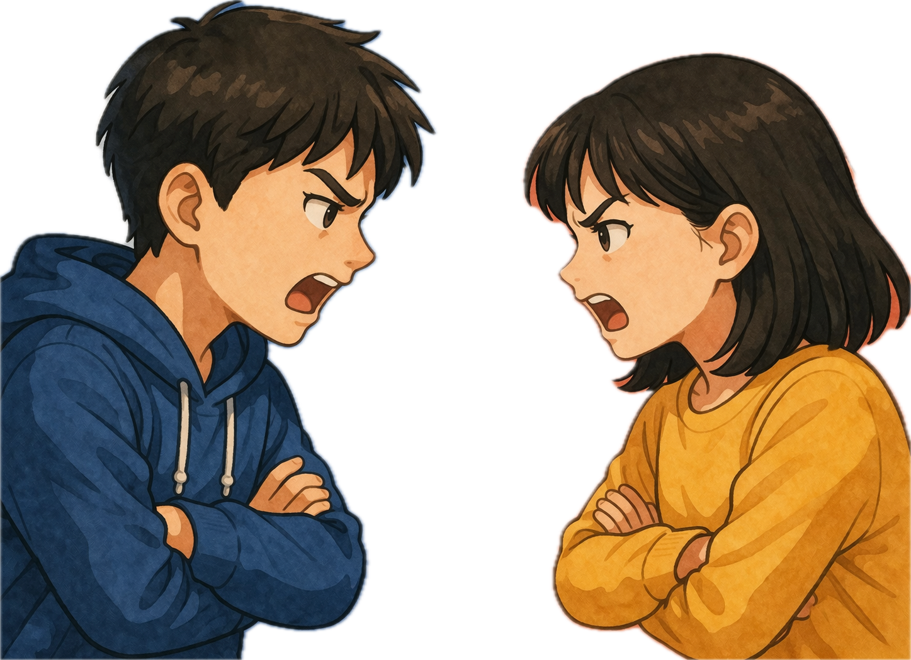
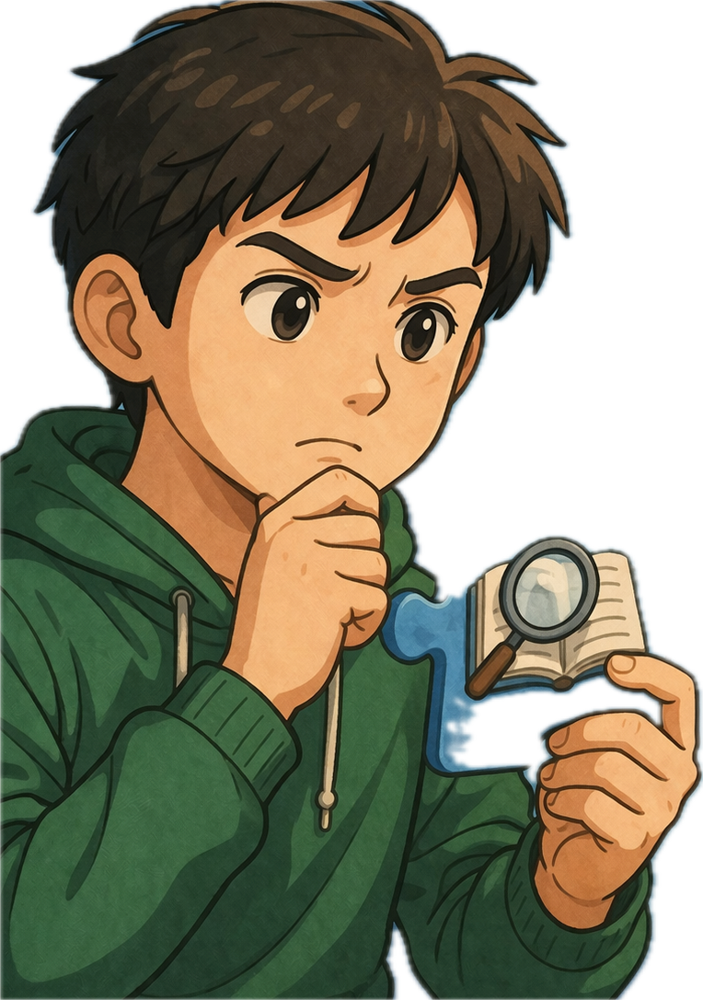
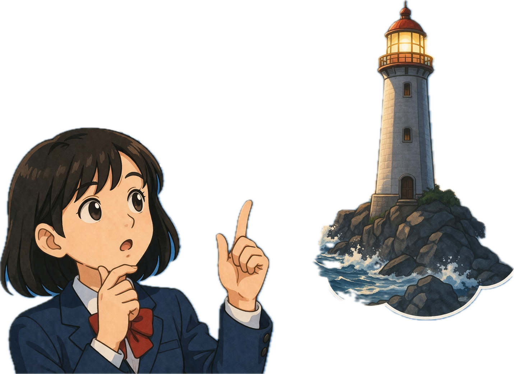
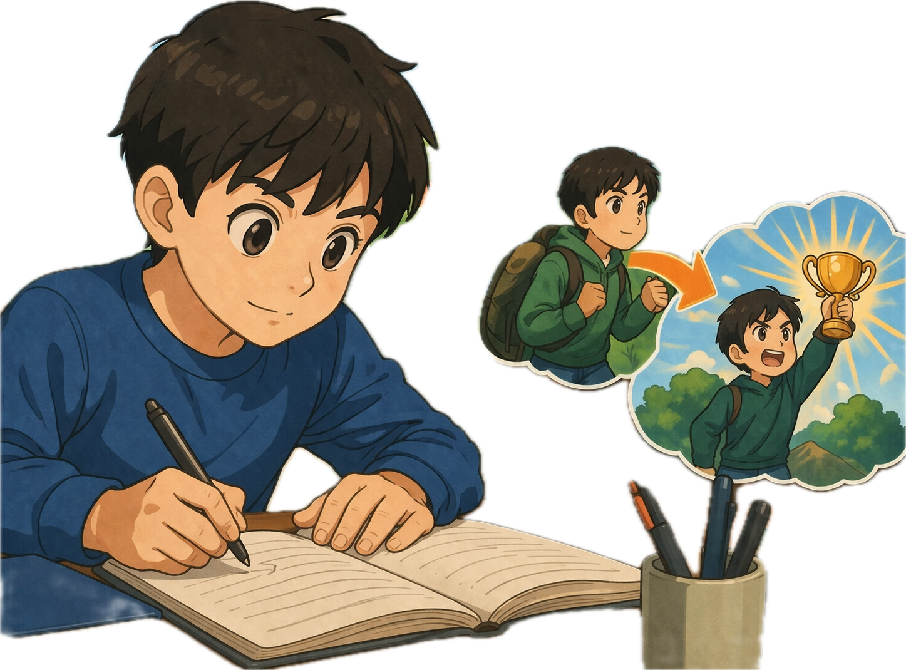
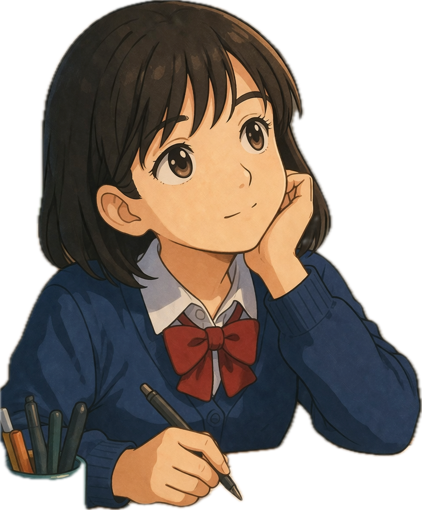
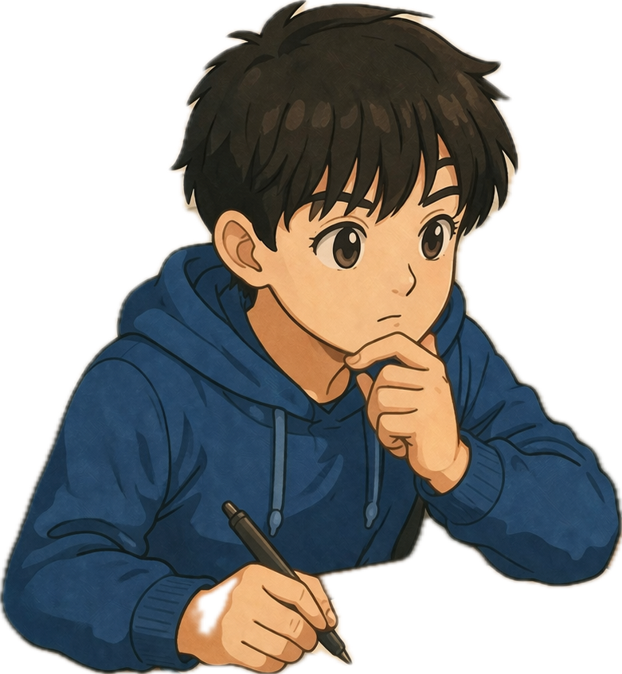
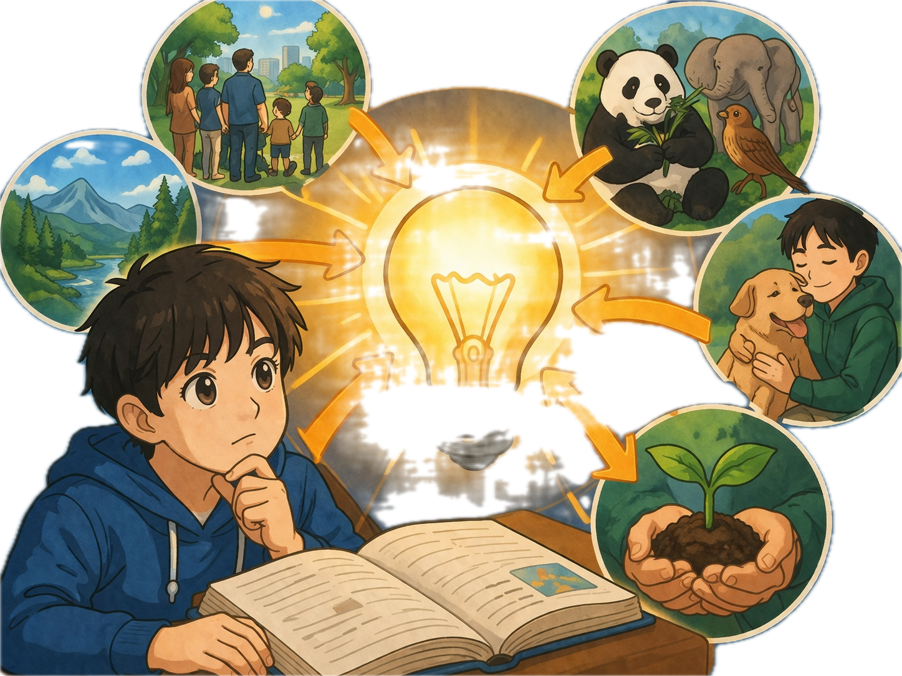
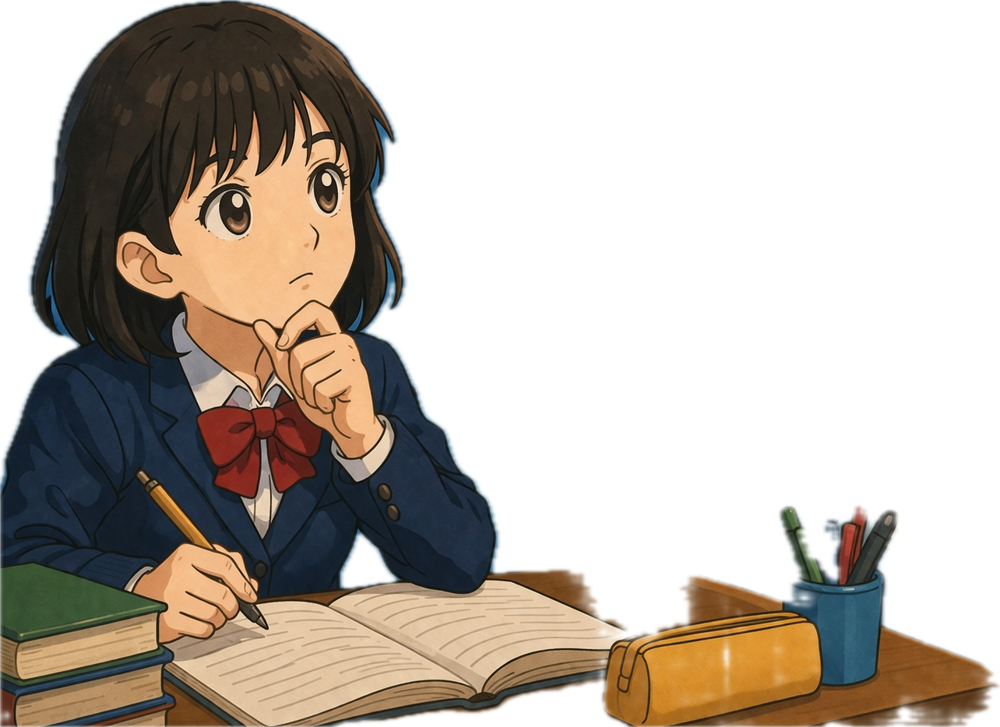
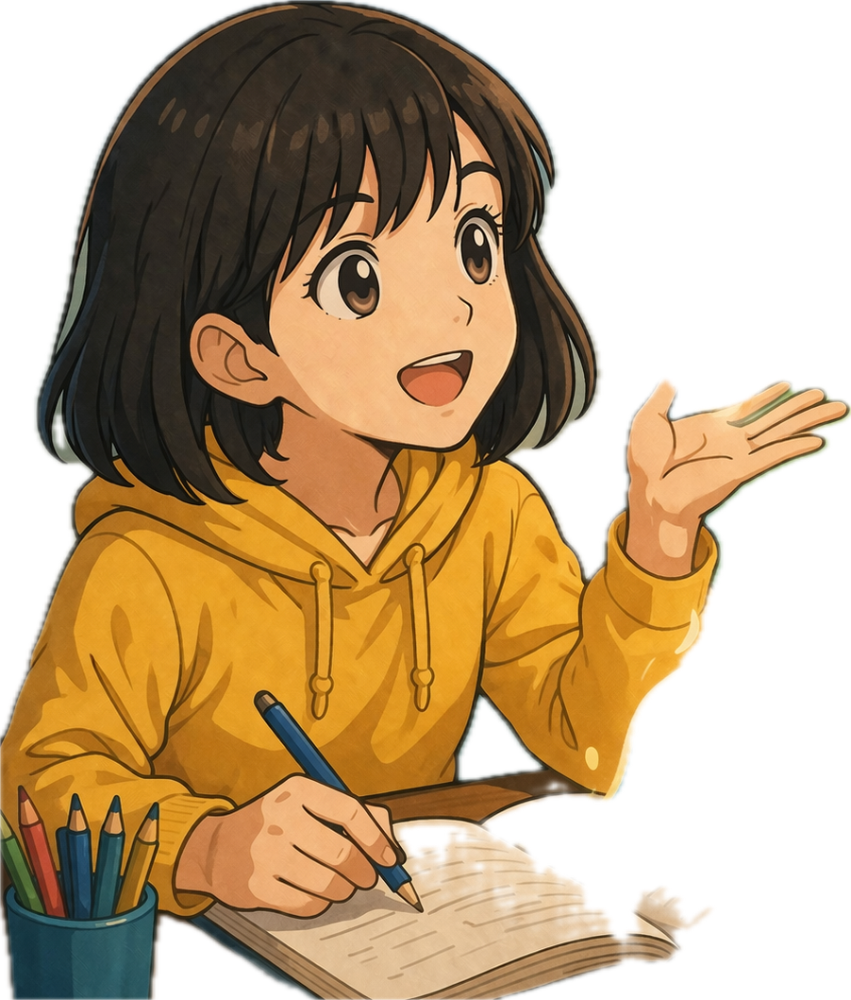
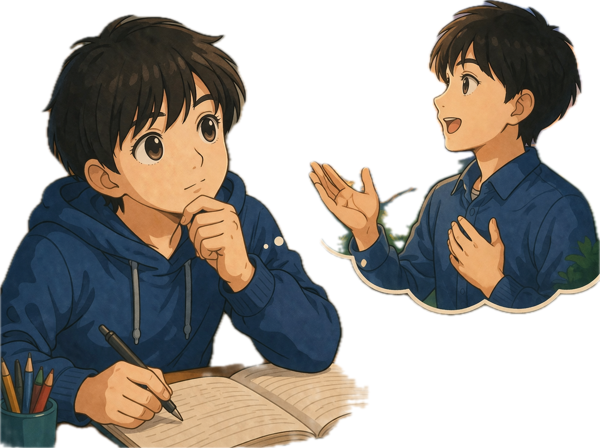

# memory deck
@title: 국어 개념어
@subject: 국어
@category: concept
@tags: 국어,개념,독해,시험
@priority: 8
@interval: 3

| 단어 | 의미 | 프롬프트 | 도해 |
| --- | --- | --- | --- |
| 갈등 | 서로 다른 생각이나 이해가 충돌하는 상태 | 중학생 학습용 개념 그림 한 장을 만들어줘. 단어: 갈등 의미: 서로 다른 생각이나 이해가 충돌하는 상태 조건: - 비율 4:3 - 텍스트, 글자, 단어, 자막, 라벨 넣지 말 것 - 영어/한글 삽입 금지 - 노트북 화면, 포스터, 인포그래픽 프레임, 말풍선 금지 - 핵심 장면만 크게 - 흰 여백 최소화 - 단순한 교과서형 도해 스타일 |  |
| 근거 | 주장이나 판단의 이유가 되는 내용 | 중학생 학습용 개념 그림 한 장을 만들어줘. 단어: 근거 의미: 주장이나 판단의 이유가 되는 내용 조건: - 비율 4:3 - 텍스트, 글자, 단어, 자막, 라벨 넣지 말 것 - 영어/한글 삽입 금지 - 노트북 화면, 포스터, 인포그래픽 프레임, 말풍선 금지 - 핵심 장면만 크게 - 흰 여백 최소화 - 단순한 교과서형 도해 스타일 |  |
| 비유 | 어떤 대상을 다른 대상에 빗대어 표현함 | 중학생 학습용 개념 그림 한 장을 만들어줘. 단어: 비유 의미: 어떤 대상을 다른 대상에 빗대어 표현함 조건: - 비율 4:3 - 텍스트, 글자, 단어, 자막, 라벨 넣지 말 것 - 영어/한글 삽입 금지 - 노트북 화면, 포스터, 인포그래픽 프레임, 말풍선 금지 - 핵심 장면만 크게 - 흰 여백 최소화 - 단순한 교과서형 도해 스타일 |  |
| 서술 | 사실이나 생각을 풀어서 말하거나 적음 | 중학생 학습용 개념 그림 한 장을 만들어줘. 단어: 서술 의미: 사실이나 생각을 풀어서 말하거나 적음 조건: - 비율 4:3 - 텍스트, 글자, 단어, 자막, 라벨 넣지 말 것 - 영어/한글 삽입 금지 - 노트북 화면, 포스터, 인포그래픽 프레임, 말풍선 금지 - 핵심 장면만 크게 - 흰 여백 최소화 - 단순한 교과서형 도해 스타일 |  |
| 심상 | 마음속에 떠오르는 이미지 | 중학생 학습용 개념 그림 한 장을 만들어줘. 단어: 심상 의미: 마음속에 떠오르는 이미지 조건: - 비율 4:3 - 텍스트, 글자, 단어, 자막, 라벨 넣지 말 것 - 영어/한글 삽입 금지 - 노트북 화면, 포스터, 인포그래픽 프레임, 말풍선 금지 - 핵심 장면만 크게 - 흰 여백 최소화 - 단순한 교과서형 도해 스타일 |  |
| 요약 | 중요한 내용만 간단하게 정리함 | 중학생 학습용 개념 그림 한 장을 만들어줘. 단어: 요약 의미: 중요한 내용만 간단하게 정리함 조건: - 비율 4:3 - 텍스트, 글자, 단어, 자막, 라벨 넣지 말 것 - 영어/한글 삽입 금지 - 노트북 화면, 포스터, 인포그래픽 프레임, 말풍선 금지 - 핵심 장면만 크게 - 흰 여백 최소화 - 단순한 교과서형 도해 스타일 |  |
| 주제 | 글 전체에서 중심이 되는 생각 | 중학생 학습용 개념 그림 한 장을 만들어줘. 단어: 주제 의미: 글 전체에서 중심이 되는 생각 조건: - 비율 4:3 - 텍스트, 글자, 단어, 자막, 라벨 넣지 말 것 - 영어/한글 삽입 금지 - 노트북 화면, 포스터, 인포그래픽 프레임, 말풍선 금지 - 핵심 장면만 크게 - 흰 여백 최소화 - 단순한 교과서형 도해 스타일 |  |
| 추론 | 주어진 내용을 바탕으로 미루어 생각함 | 중학생 학습용 개념 그림 한 장을 만들어줘. 단어: 추론 의미: 주어진 내용을 바탕으로 미루어 생각함 조건: - 비율 4:3 - 텍스트, 글자, 단어, 자막, 라벨 넣지 말 것 - 영어/한글 삽입 금지 - 노트북 화면, 포스터, 인포그래픽 프레임, 말풍선 금지 - 핵심 장면만 크게 - 흰 여백 최소화 - 단순한 교과서형 도해 스타일 |  |
| 표현 | 생각이나 느낌을 말이나 글로 나타냄 | 중학생 학습용 개념 그림 한 장을 만들어줘. 단어: 표현 의미: 생각이나 느낌을 말이나 글로 나타냄 조건: - 비율 4:3 - 텍스트, 글자, 단어, 자막, 라벨 넣지 말 것 - 영어/한글 삽입 금지 - 노트북 화면, 포스터, 인포그래픽 프레임, 말풍선 금지 - 핵심 장면만 크게 - 흰 여백 최소화 - 단순한 교과서형 도해 스타일 |  |
| 화자 | 시나 글에서 말을 하는 주체 | 중학생 학습용 개념 그림 한 장을 만들어줘. 단어: 화자 의미: 시나 글에서 말을 하는 주체 조건: - 비율 4:3 - 텍스트, 글자, 단어, 자막, 라벨 넣지 말 것 - 영어/한글 삽입 금지 - 노트북 화면, 포스터, 인포그래픽 프레임, 말풍선 금지 - 핵심 장면만 크게 - 흰 여백 최소화 - 단순한 교과서형 도해 스타일 |  |
