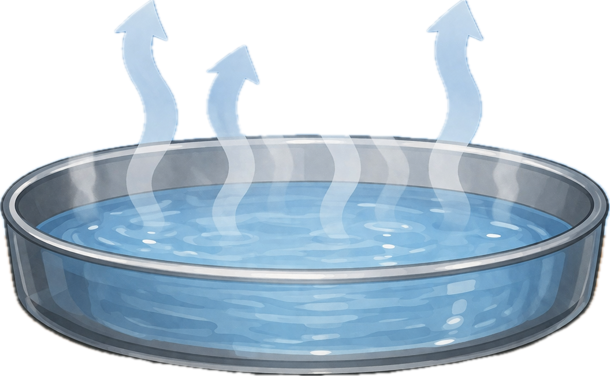
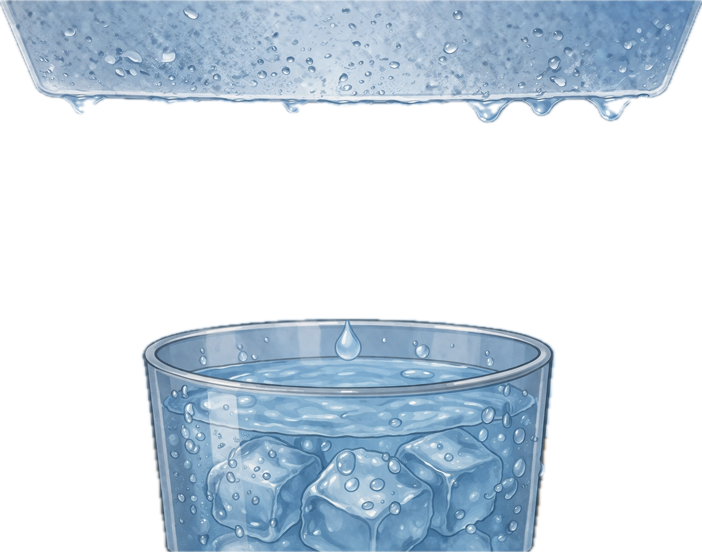
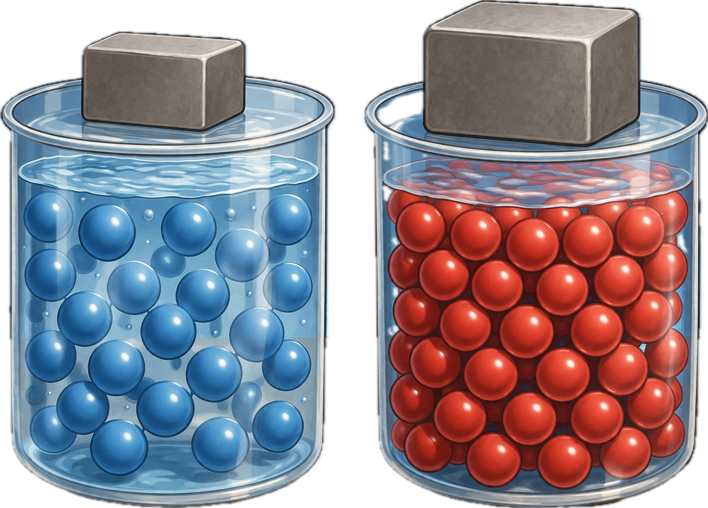
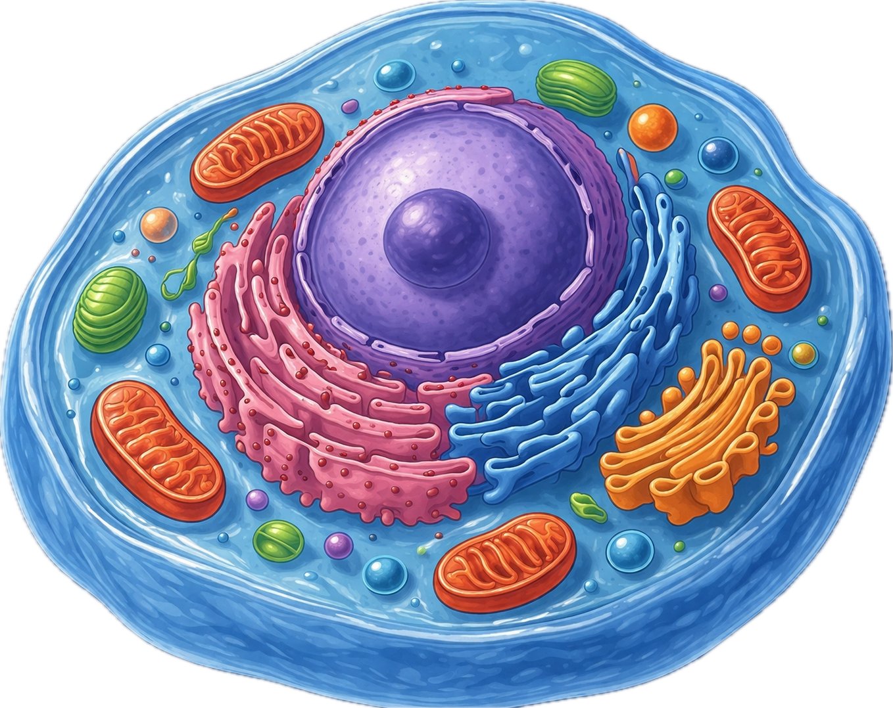
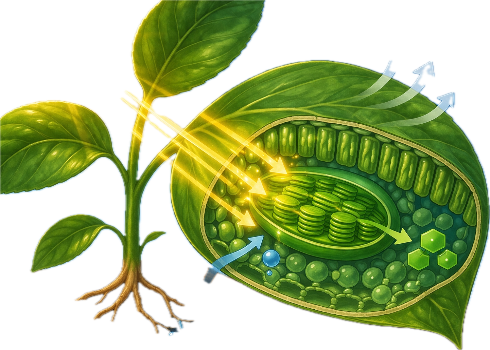
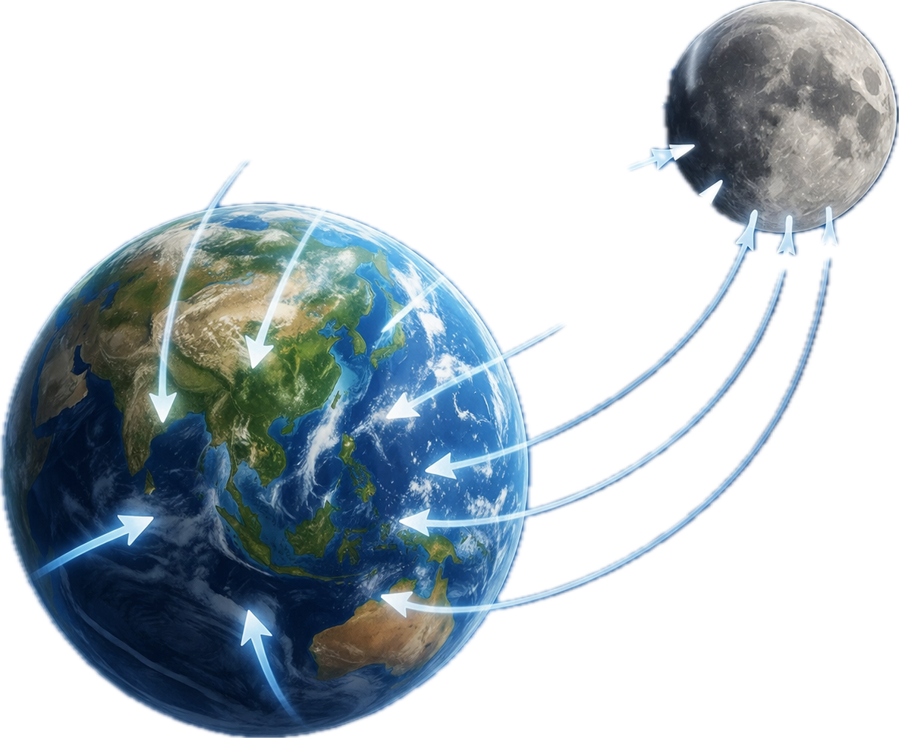
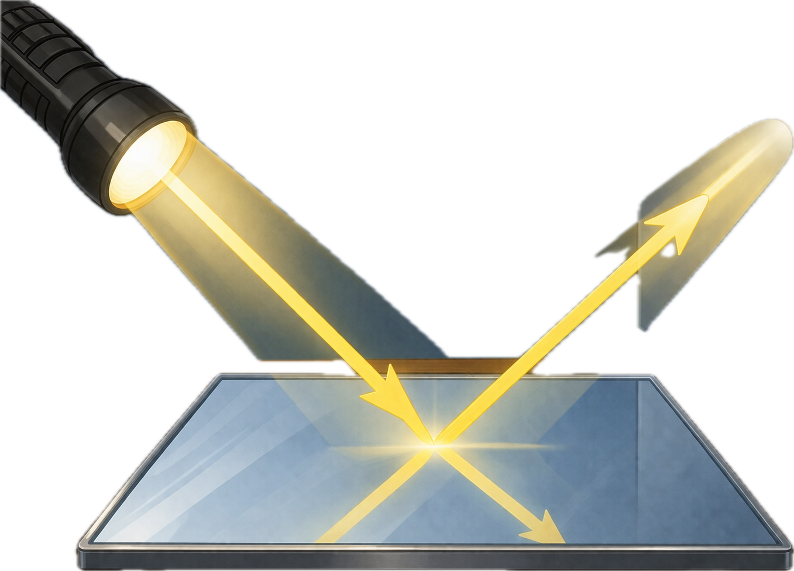
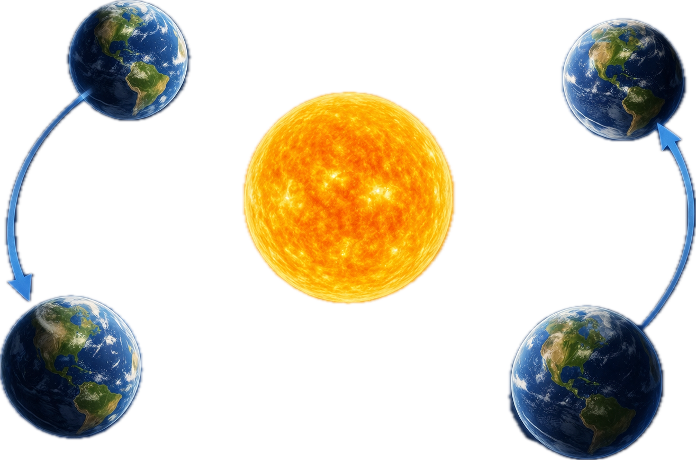

# memory deck
@title: 과학 핵심 용어
@subject: 과학
@category: concept
@tags: 과학,용어,중등,시험
@priority: 7
@interval: 3

| 단어 | 의미 | 프롬프트 | 도해 |
| --- | --- | --- | --- |
| 증발 | 액체가 기체로 변하는 현상 | 학습용 메모리카드에 들어갈 개념 그림 한 장을 만들어줘. 단어: 증발 의미: 액체가 기체로 변하는 현상 조건: - 비율 4:3 - 텍스트, 글자, 단어, 자막, 라벨 넣지 말 것 - 영어/한글 삽입 금지 - 노트북 화면, 포스터, 인포그래픽 프레임, 말풍선 금지 - 핵심 장면만 크게 - 흰 여백 최소화 - 단순한 교과서형 도해 스타일 |  |
| 응결 | 기체가 액체로 변하는 현상 | 학습용 메모리카드에 들어갈 개념 그림 한 장을 만들어줘. 단어: 응결 의미: 기체가 액체로 변하는 현상 조건: - 비율 4:3 - 텍스트, 글자, 단어, 자막, 라벨 넣지 말 것 - 영어/한글 삽입 금지 - 노트북 화면, 포스터, 인포그래픽 프레임, 말풍선 금지 - 핵심 장면만 크게 - 흰 여백 최소화 - 단순한 교과서형 도해 스타일 |  |
| 밀도 | 물질의 부피당 질량 | 학습용 메모리카드에 들어갈 개념 그림 한 장을 만들어줘. 단어: 밀도 의미: 물질의 부피당 질량 조건: - 비율 4:3 - 텍스트, 글자, 단어, 자막, 라벨 넣지 말 것 - 영어/한글 삽입 금지 - 노트북 화면, 포스터, 인포그래픽 프레임, 말풍선 금지 - 핵심 장면만 크게 - 흰 여백 최소화 - 단순한 교과서형 도해 스타일 |  |
| 세포 | 생물체를 이루는 기본 단위 | 학습용 메모리카드에 들어갈 개념 그림 한 장을 만들어줘. 단어: 세포 의미: 생물체를 이루는 기본 단위 조건: - 비율 4:3 - 텍스트, 글자, 단어, 자막, 라벨 넣지 말 것 - 영어/한글 삽입 금지 - 노트북 화면, 포스터, 인포그래픽 프레임, 말풍선 금지 - 핵심 장면만 크게 - 흰 여백 최소화 - 단순한 교과서형 도해 스타일 |  |
| 광합성 | 식물이 빛에너지를 이용해 양분을 만드는 과정 | 학습용 메모리카드에 들어갈 개념 그림 한 장을 만들어줘. 단어: 광합성 의미: 식물이 빛에너지를 이용해 양분을 만드는 과정 조건: - 비율 4:3 - 텍스트, 글자, 단어, 자막, 라벨 넣지 말 것 - 영어/한글 삽입 금지 - 노트북 화면, 포스터, 인포그래픽 프레임, 말풍선 금지 - 핵심 장면만 크게 - 흰 여백 최소화 - 단순한 교과서형 도해 스타일 |  |
| 중력 | 물체를 서로 끌어당기는 힘 | 학습용 메모리카드에 들어갈 개념 그림 한 장을 만들어줘. 단어: 중력 의미: 물체를 서로 끌어당기는 힘 조건: - 비율 4:3 - 텍스트, 글자, 단어, 자막, 라벨 넣지 말 것 - 영어/한글 삽입 금지 - 노트북 화면, 포스터, 인포그래픽 프레임, 말풍선 금지 - 핵심 장면만 크게 - 흰 여백 최소화 - 단순한 교과서형 도해 스타일 |  |
| 속력 | 단위 시간 동안 이동한 거리 | 학습용 메모리카드에 들어갈 개념 그림 한 장을 만들어줘. 단어: 속력 의미: 단위 시간 동안 이동한 거리 조건: - 비율 4:3 - 텍스트, 글자, 단어, 자막, 라벨 넣지 말 것 - 영어/한글 삽입 금지 - 노트북 화면, 포스터, 인포그래픽 프레임, 말풍선 금지 - 핵심 장면만 크게 - 흰 여백 최소화 - 단순한 교과서형 도해 스타일 |  |
| 전도 | 열이 직접 전달되는 방법 | 학습용 메모리카드에 들어갈 개념 그림 한 장을 만들어줘. 단어: 전도 의미: 열이 직접 전달되는 방법 조건: - 비율 4:3 - 텍스트, 글자, 단어, 자막, 라벨 넣지 말 것 - 영어/한글 삽입 금지 - 노트북 화면, 포스터, 인포그래픽 프레임, 말풍선 금지 - 핵심 장면만 크게 - 흰 여백 최소화 - 단순한 교과서형 도해 스타일 |  |
| 반사 | 빛이 물체에 부딪혀 되돌아오는 현상 | 학습용 메모리카드에 들어갈 개념 그림 한 장을 만들어줘. 단어: 반사 의미: 빛이 물체에 부딪혀 되돌아오는 현상 조건: - 비율 4:3 - 텍스트, 글자, 단어, 자막, 라벨 넣지 말 것 - 영어/한글 삽입 금지 - 노트북 화면, 포스터, 인포그래픽 프레임, 말풍선 금지 - 핵심 장면만 크게 - 흰 여백 최소화 - 단순한 교과서형 도해 스타일 |  |
| 공전 | 천체가 다른 천체 주위를 도는 운동 | 학습용 메모리카드에 들어갈 개념 그림 한 장을 만들어줘. 단어: 공전 의미: 천체가 다른 천체 주위를 도는 운동 조건: - 비율 4:3 - 텍스트, 글자, 단어, 자막, 라벨 넣지 말 것 - 영어/한글 삽입 금지 - 노트북 화면, 포스터, 인포그래픽 프레임, 말풍선 금지 - 핵심 장면만 크게 - 흰 여백 최소화 - 단순한 교과서형 도해 스타일 |  |
