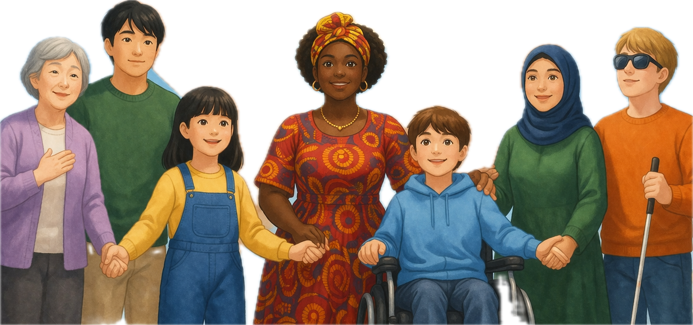
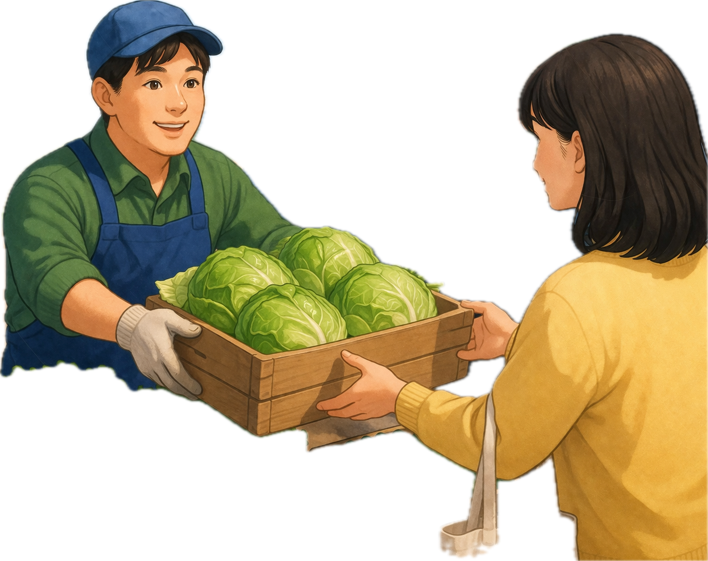
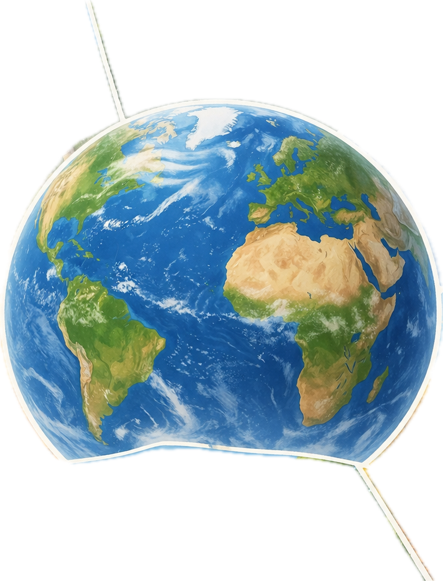
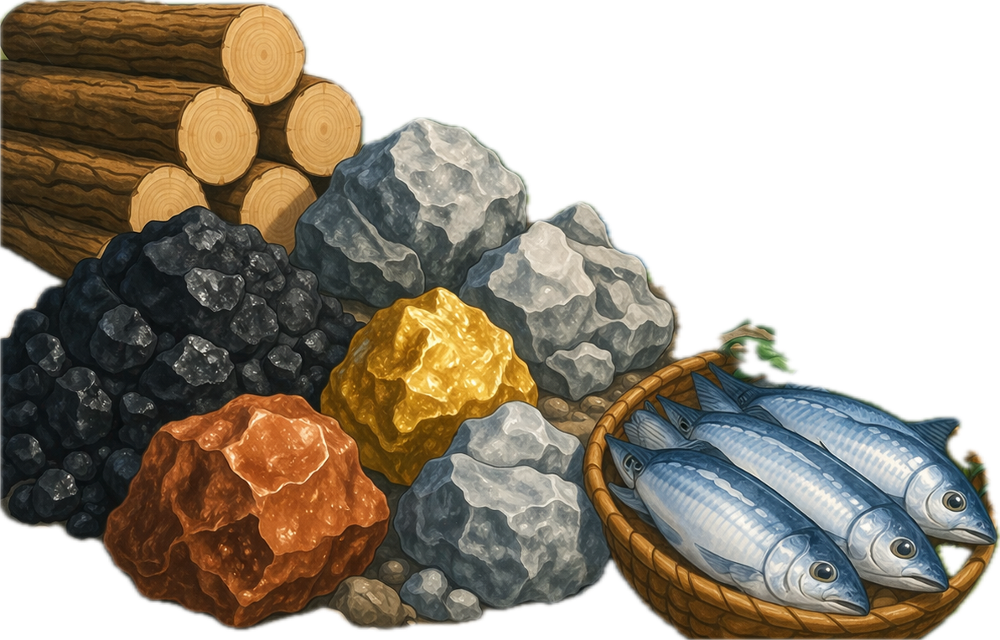
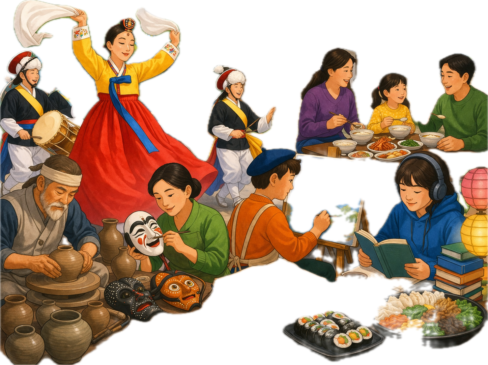

# memory deck
@title: 사회 핵심 용어
@subject: 사회
@category: concept
@tags: 사회,용어,지리,일반사회
@priority: 7
@interval: 3

| 단어 | 의미 | 프롬프트 | 도해 |
| --- | --- | --- | --- |
| 민주주의 | 국민이 나라의 주인이 되는 정치 원리 | 학습용 메모리카드에 들어갈 개념 그림 한 장을 만들어줘. 단어: 민주주의 의미: 국민이 나라의 주인이 되는 정치 원리 조건: - 비율 4:3 - 텍스트, 글자, 단어, 자막, 라벨 넣지 말 것 - 영어/한글 삽입 금지 - 노트북 화면, 포스터, 인포그래픽 프레임, 말풍선 금지 - 핵심 장면만 크게 - 흰 여백 최소화 - 단순한 교과서형 도해 스타일 |  |
| 헌법 | 국가의 기본 법 | 학습용 메모리카드에 들어갈 개념 그림 한 장을 만들어줘. 단어: 헌법 의미: 국가의 기본 법 조건: - 비율 4:3 - 텍스트, 글자, 단어, 자막, 라벨 넣지 말 것 - 영어/한글 삽입 금지 - 노트북 화면, 포스터, 인포그래픽 프레임, 말풍선 금지 - 핵심 장면만 크게 - 흰 여백 최소화 - 단순한 교과서형 도해 스타일 |  |
| 인권 | 사람이라면 누구나 가지는 기본적인 권리 | 학습용 메모리카드에 들어갈 개념 그림 한 장을 만들어줘. 단어: 인권 의미: 사람이라면 누구나 가지는 기본적인 권리 조건: - 비율 4:3 - 텍스트, 글자, 단어, 자막, 라벨 넣지 말 것 - 영어/한글 삽입 금지 - 노트북 화면, 포스터, 인포그래픽 프레임, 말풍선 금지 - 핵심 장면만 크게 - 흰 여백 최소화 - 단순한 교과서형 도해 스타일 |  |
| 시장 | 물건을 사고파는 곳 또는 거래가 이루어지는 구조 | 학습용 메모리카드에 들어갈 개념 그림 한 장을 만들어줘. 단어: 시장 의미: 물건을 사고파는 곳 또는 거래가 이루어지는 구조 조건: - 비율 4:3 - 텍스트, 글자, 단어, 자막, 라벨 넣지 말 것 - 영어/한글 삽입 금지 - 노트북 화면, 포스터, 인포그래픽 프레임, 말풍선 금지 - 핵심 장면만 크게 - 흰 여백 최소화 - 단순한 교과서형 도해 스타일 |  |
| 수요 | 소비자가 사고자 하는 욕구 | 학습용 메모리카드에 들어갈 개념 그림 한 장을 만들어줘. 단어: 수요 의미: 소비자가 사고자 하는 욕구 조건: - 비율 4:3 - 텍스트, 글자, 단어, 자막, 라벨 넣지 말 것 - 영어/한글 삽입 금지 - 노트북 화면, 포스터, 인포그래픽 프레임, 말풍선 금지 - 핵심 장면만 크게 - 흰 여백 최소화 - 단순한 교과서형 도해 스타일 |  |
| 공급 | 생산자가 팔고자 하는 양 | 학습용 메모리카드에 들어갈 개념 그림 한 장을 만들어줘. 단어: 공급 의미: 생산자가 팔고자 하는 양 조건: - 비율 4:3 - 텍스트, 글자, 단어, 자막, 라벨 넣지 말 것 - 영어/한글 삽입 금지 - 노트북 화면, 포스터, 인포그래픽 프레임, 말풍선 금지 - 핵심 장면만 크게 - 흰 여백 최소화 - 단순한 교과서형 도해 스타일 |  |
| 기후 | 어떤 지역에서 오랫동안 나타나는 날씨의 평균 상태 | 학습용 메모리카드에 들어갈 개념 그림 한 장을 만들어줘. 단어: 기후 의미: 어떤 지역에서 오랫동안 나타나는 날씨의 평균 상태 조건: - 비율 4:3 - 텍스트, 글자, 단어, 자막, 라벨 넣지 말 것 - 영어/한글 삽입 금지 - 노트북 화면, 포스터, 인포그래픽 프레임, 말풍선 금지 - 핵심 장면만 크게 - 흰 여백 최소화 - 단순한 교과서형 도해 스타일 |  |
| 자원 | 생활에 이용할 수 있는 여러 재료나 에너지 | 학습용 메모리카드에 들어갈 개념 그림 한 장을 만들어줘. 단어: 자원 의미: 생활에 이용할 수 있는 여러 재료나 에너지 조건: - 비율 4:3 - 텍스트, 글자, 단어, 자막, 라벨 넣지 말 것 - 영어/한글 삽입 금지 - 노트북 화면, 포스터, 인포그래픽 프레임, 말풍선 금지 - 핵심 장면만 크게 - 흰 여백 최소화 - 단순한 교과서형 도해 스타일 |  |
| 산업 | 재화나 서비스를 생산하는 활동 | 학습용 메모리카드에 들어갈 개념 그림 한 장을 만들어줘. 단어: 산업 의미: 재화나 서비스를 생산하는 활동 조건: - 비율 4:3 - 텍스트, 글자, 단어, 자막, 라벨 넣지 말 것 - 영어/한글 삽입 금지 - 노트북 화면, 포스터, 인포그래픽 프레임, 말풍선 금지 - 핵심 장면만 크게 - 흰 여백 최소화 - 단순한 교과서형 도해 스타일 |  |
| 문화 | 사람들이 함께 살아가며 만든 생활 양식 | 학습용 메모리카드에 들어갈 개념 그림 한 장을 만들어줘. 단어: 문화 의미: 사람들이 함께 살아가며 만든 생활 양식 조건: - 비율 4:3 - 텍스트, 글자, 단어, 자막, 라벨 넣지 말 것 - 영어/한글 삽입 금지 - 노트북 화면, 포스터, 인포그래픽 프레임, 말풍선 금지 - 핵심 장면만 크게 - 흰 여백 최소화 - 단순한 교과서형 도해 스타일 |  |
